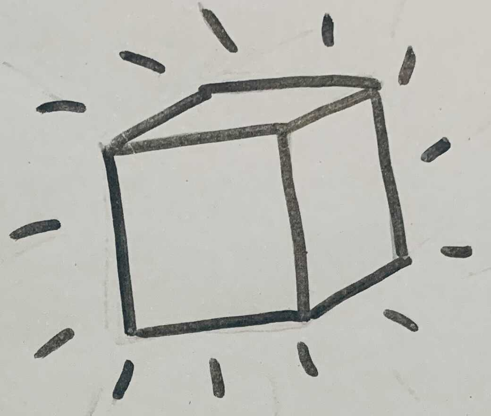

# :heart: Ft_services :heart:
Here, we are going to compare K8s to a little cutie house that we'll try to build.

Of course we gonna succeed, we are not goats !!!
## Kube construction


`$ minikube start [option]`


In this project, we only need one cluster so one room in the house.

## Add a door
### Goal
Connect the inside of the house (= the room) with the external world (aka. Load Balancer)
### Needed
- place of tools (aka. namespace)
- position & size (aka. adresses range)
=> Create a ConfigMap

search metallb.yaml (tools)


```
$ kubectl apply -f metallb.yaml
$ kubectl apply -f configmap.yaml
```

