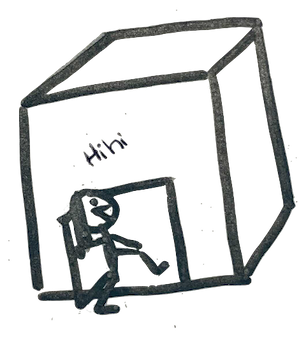

# :heart: Ft_services :heart:
Welcome into my ft_services, if, like me, you are not familiar with the vocaculary of computing, you are in the right place. Here, I'll try to explain ft_services with metaphors. But you need to already tried to understanding kubernetes, i only helping you to simplify your vision. You have to complete my steps with your own researches.

We are going to compare the cluster to a little cutie house that we'll try to build. :cherry_blossom:

Try ? OF COURSE WE WILL SUCCEED, WE ARE NOT STUPID GOATS !!!
## Kube construction


obvious command: 
`$ minikube start [option]`


## Add a door
(aka. Load Balancer)
### Goal
Connect the inside of the house to the external world.
### Needed (aka. ConfigMap)
- protocole : according to the utility of a door (= connecting the differents rooms of a house to the outside), we'll use the protocole layer2 to create the door. If you don't understanding why :

- tools : OMG but how can i know where i can find the tools needed ?? :sob: CALM DOWN !!! :lotus_position_woman: I'm not sure yet but for the momemt you just need to find in the beautyful internetmarche how to install metallb and check the place (aka. namespace) in the config file 
- choose the position & the size of the door (aka. adresses range)

```
$ kubectl apply -f metallb.yaml
$ kubectl apply -f configmap.yaml
```


## Arrange the rooms
(aka. nodes)

Every room has it's own function (aka. service) => kitchen, living room, etc ... :bath:
