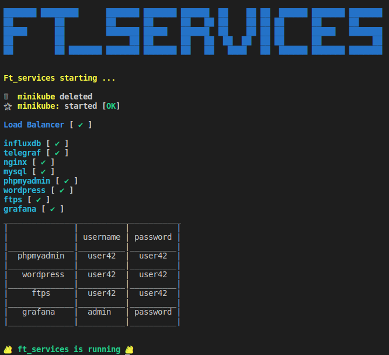

# Ft_services
This is a System Administration and Networking project.

## Objective
This project introduce to Kubernetes:
- discover cluster management and deployment with Kubernetes
- virtualize a network and do "clustering".

## Usage

*Only on linux*

```
$ git clone https://github.com/adbenoit-9/42_ft_services.git
$ cd 42_ft_services
$ sh setup.sh
```

## Preview

